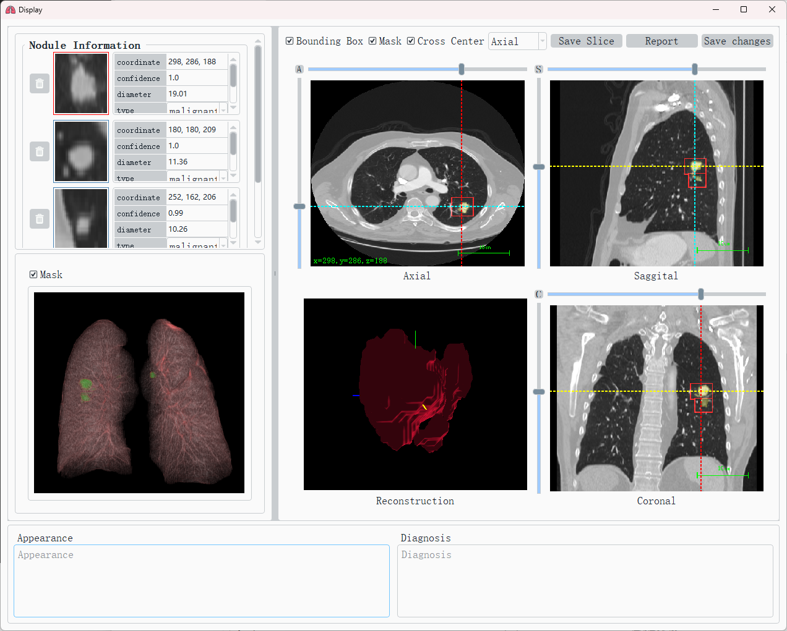
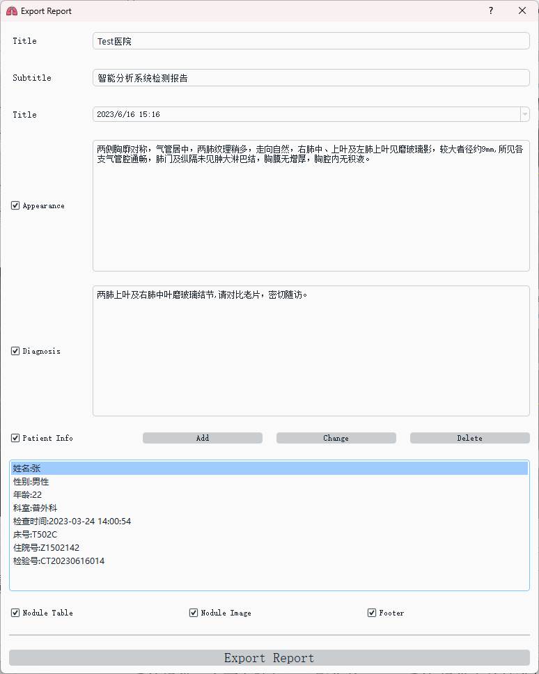
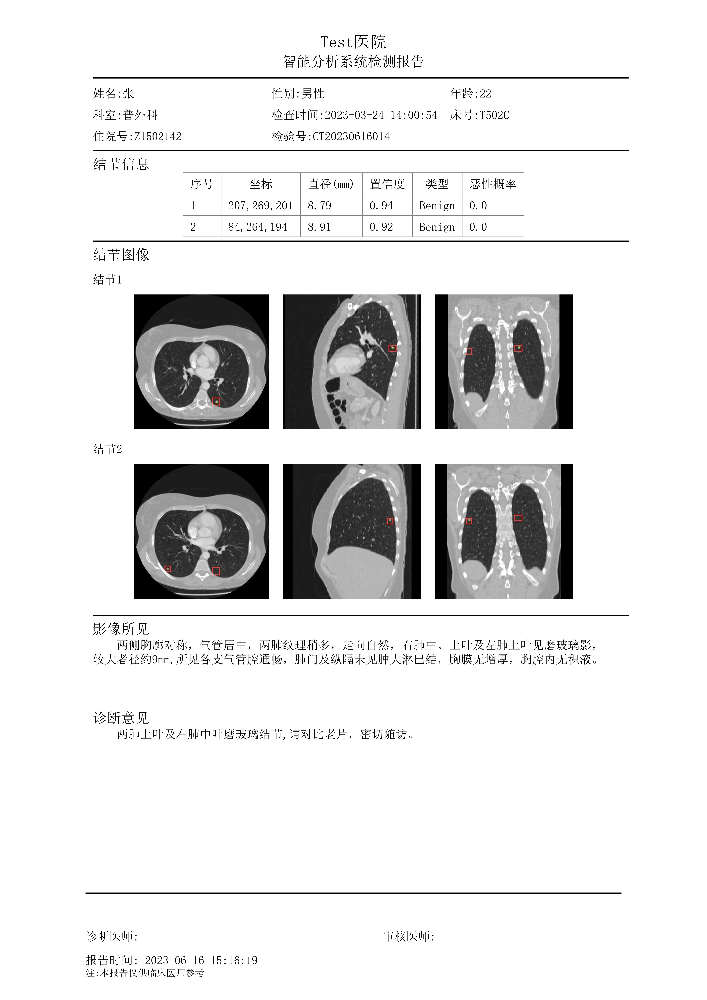
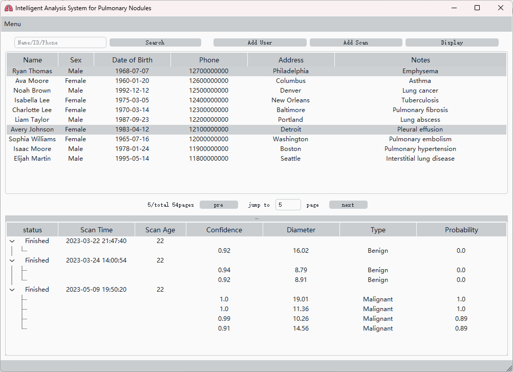

# Nodule-System-Python

## 介绍
肺结节分析系统客户端与推理端

包含了基于Rabbitmq和Pytorch的推理端和基于PyQt的客户端，需要配合java服务端使用

其中模型文件需要手动下载：

链接：https://pan.baidu.com/s/1MAo3kcJYf6ZRf78iZd0FNg?pwd=xyfn 
提取码：xyfn 

放置在mqService/model文件夹中

三维重建

报告导出

信息管理

## 后端：
https://github.com/icyclv/NoduleSystem-Backend

## 架构
PyQT客户端 ->http-> SpringBoot服务端 ->mq-> Pytorch推理端

## 参考项目：
- Nodule-CADx ： https://github.com/wenyalintw/Nodule-CADx
